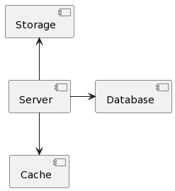

# CandyShop

This application helps people to buy various confectionery products for their business.

You can access Swagger and see all available endpoints by visiting `http://localhost:8080/swagger-ui/index.html`

## Sequence diagram

## Component diagram

Main application communicates with cache (Redis), database (Postgresql), storage (MinIO).

## Class diagram

I have some main classes - **User** , **Product** , **Basket** and **Order**

**User** class represents user in this application. User can login, registr, create and delete orders,
add products in the basket.

User can have roles - `ROLE_USER` or `ROLE_ADMIN`.

## Environments

To run this application you need to create `.env` file in root directory with next environments:

- `HOST` - host of Postgresql database
- `POSTGRES_USERNAME` - username for Postgresql database
- `POSTGRES_PASSWORD` - password for Postgresql database
- `POSTGRES_DATABASE` - name of Postgresql database
- `POSTGRES_SCHEMA` - name of Postgresql schema
- `REDIS_HOST` - host of Redis instance
- `REDIS_PASSWORD` - password for Redis
- `JWT_SECRET` - secret string for JWT tokens
- `MINIO_BUCKET` - name of bucket for MinIO
- `MINIO_URL` - URL of MinIO instance
- `MINIO_ACCESS_KEY` - access key of MinIO
- `MINIO_SECRET_KEY` - secret key of MinIO

## Dockerhub link
https://hub.docker.com/repository/docker/vladmarmuz/candy-shop/general

To download the image from dockerhub you need to run the following command
###  docker pull vladmarmuz/candy-shop
